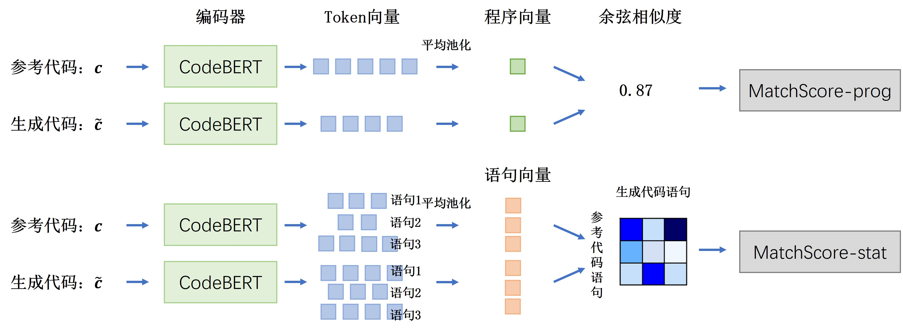
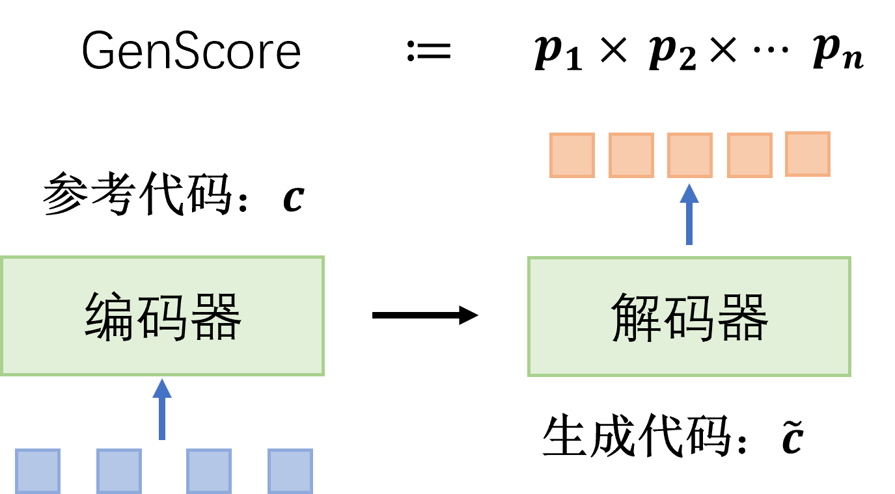
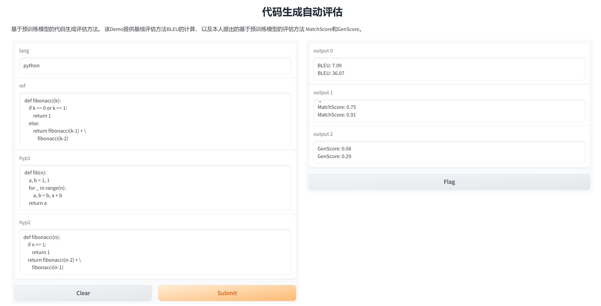

# Code-eval-score
This is a package for evaluting the quality of code generated by AI models.

We provide two ways to evaluate the code quality:
* MatchScore: uses the CodeBERT model to calculate the similarity between the hypothesis code and the reference code.
* GenScore: uses the CodeT5 model to calculate the probability of generating hypothesis code from the reference code.

## Method

### MatchScore

MatchScore uses CodeBERT to compute the semantic similarity between reference code and generated code.

<!-- insert png with 0.8 size-->
<p align="center">
    
</p>

### GenScore

GenScore uses CodeT5 to compute the probability of generating hypothesis code from the reference code.

<!-- insert png with 0.8 size-->
<p align="center">
    
</p>

## Demo Usage

```python
# !pip install code-eval-score==0.1.0

from code_eval_score import matchscore
from code_eval_score import genscore


s1 = """
x ** 0.5
"""

s2 = """
math.sqrt(x)
"""

match_scores = matchscore.calculate(
    cands=[[s1]],
    refs=[[s2]],
    lang="python",
    device="cpu",
    batch_size=1,
)

gen_scores = genscore.calculate(
    cands=[s1],
    refs=[s2],
    lang="python",
    device="cpu",
    batch_size=1,
)

print(match_scores, gen_scores)
# Output: 1.00, 0.08
```

## Gradio Demo

I have deployed a demo with Gradio and Huggingface Space: [Lzzzq/CodeGenEval](https://huggingface.co/spaces/Lzzzq/CodeGenEval/tree/main).
Due to the limitation of the free plan, the demo cann't be run on the huggingface server. You can deploy it on your own server.

<!-- insert png with 0.8 size-->
<p align="center">
    